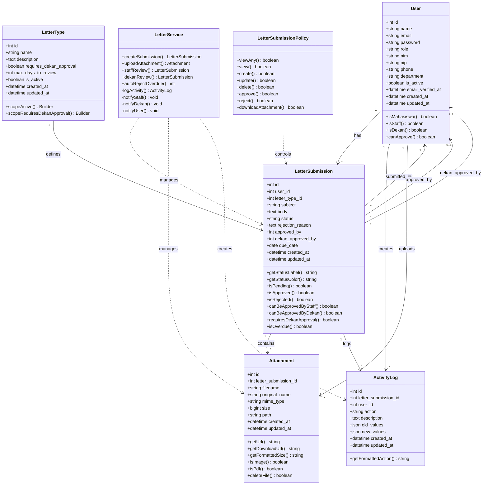

# Class Diagram - Sistem Pengajuan Surat Perizinan Kampus

## Class Diagram (Mermaid)



## Deskripsi Class

| Class | Deskripsi | Relasi |
|-------|-----------|--------|
| User | Pengguna sistem (Mahasiswa, Staff, Dekan) | Memiliki banyak LetterSubmission, ActivityLog, Attachment |
| LetterType | Jenis surat yang tersedia | Mendefinisikan LetterSubmission |
| LetterSubmission | Pengajuan surat yang dibuat | Memiliki Attachment, ActivityLog, di-submit oleh User |
| Attachment | File lampiran yang diunggah | Milik LetterSubmission |
| ActivityLog | Log aktivitas pada pengajuan | Milik LetterSubmission dan User |
| LetterService | Service layer untuk bisnis logic | Mengelola LetterSubmission, Attachment, ActivityLog |
| LetterSubmissionPolicy | Policy untuk otorisasi | Mengontrol akses LetterSubmission |

## Status Transitions

```
pending → staff_reviewed (jika requires_dekan_approval)
pending → approved (jika tidak requires_dekan_approval)
pending → rejected
staff_reviewed → approved (oleh dekan)
staff_reviewed → rejected (oleh dekan)
```
