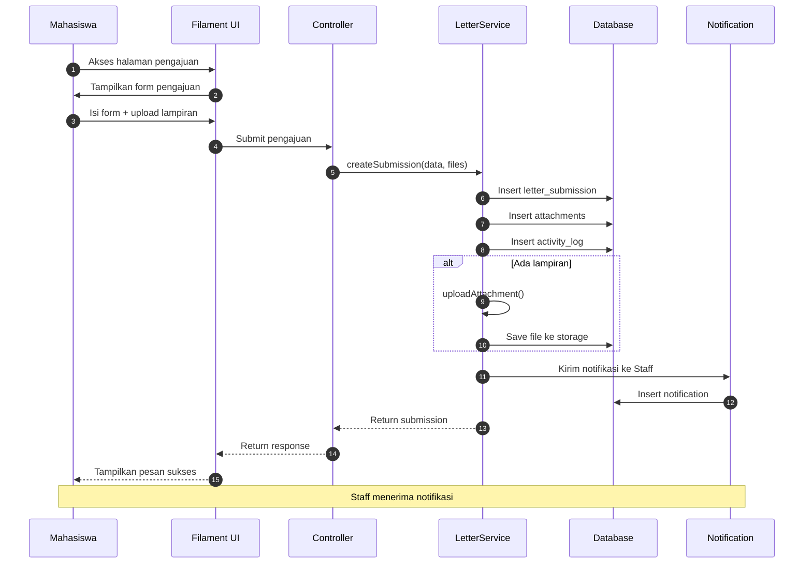

# Sequence Diagram - Alur Utama (Pengajuan Surat)

## Alur: Mahasiswa Mengajukan Surat

## Deskripsi Alur

1. **Mahasiswa** mengakses halaman pengajuan surat
2. **Filament UI** menampilkan form pengajuan
3. **Mahasiswa** mengisi form dan mengunggah lampiran
4. **Controller** menerima data dan meneruskan ke **LetterService**
5. **LetterService** menyimpan pengajuan ke database
6. **LetterService** menyimpan lampiran jika ada
7. **LetterService** mencatat aktivitas ke activity log
8. **LetterService** mengirim notifikasi ke staff
9. **Mahasiswa** menerima pesan sukses
