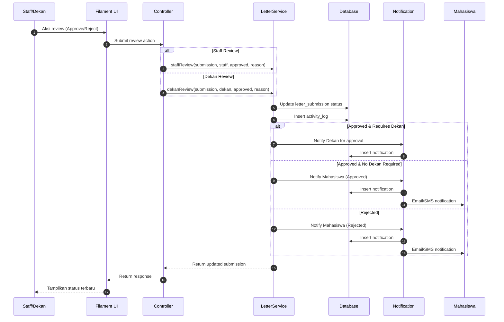

# Sequence Diagram - Alur Kedua (Proses Persetujuan)

## Alur: Staff/Dekan Review dan Approve/Reject



## Deskripsi Alur

### Alur Review oleh Staff
1. **Staff** memilih pengajuan untuk direview
2. **Filament UI** menampilkan detail pengajuan
3. **Staff** memilih approve atau reject
4. **Controller** menerima aksi dan meneruskan ke **LetterService**
5. **LetterService** memanggil `staffReview()`:
   - Jika approve &requires dekan → status = `staff_reviewed`, notifikasi ke dekan
   - Jika approve &tidak requires dekan → status = `approved`, notifikasi ke mahasiswa
   - Jika reject → status = `rejected`, notifikasi ke mahasiswa

### Alur Review oleh Dekan
1. **Dekan** melihat pengajuan yang perlu persetujuan
2. **Dekan** memilih approve atau reject
3. **LetterService** memanggil `dekanReview()`:
   - Jika approve → status = `approved`, notifikasi ke mahasiswa
   - Jika reject → status = `rejected`, notifikasi ke mahasiswa

### Status Transitions
```
pending → staff_reviewed (Staff approve, requires dekan)
pending → approved (Staff approve, tidak requires dekan)
pending → rejected (Staff reject)
staff_reviewed → approved (Dekan approve)
staff_reviewed → rejected (Dekan reject)
```
