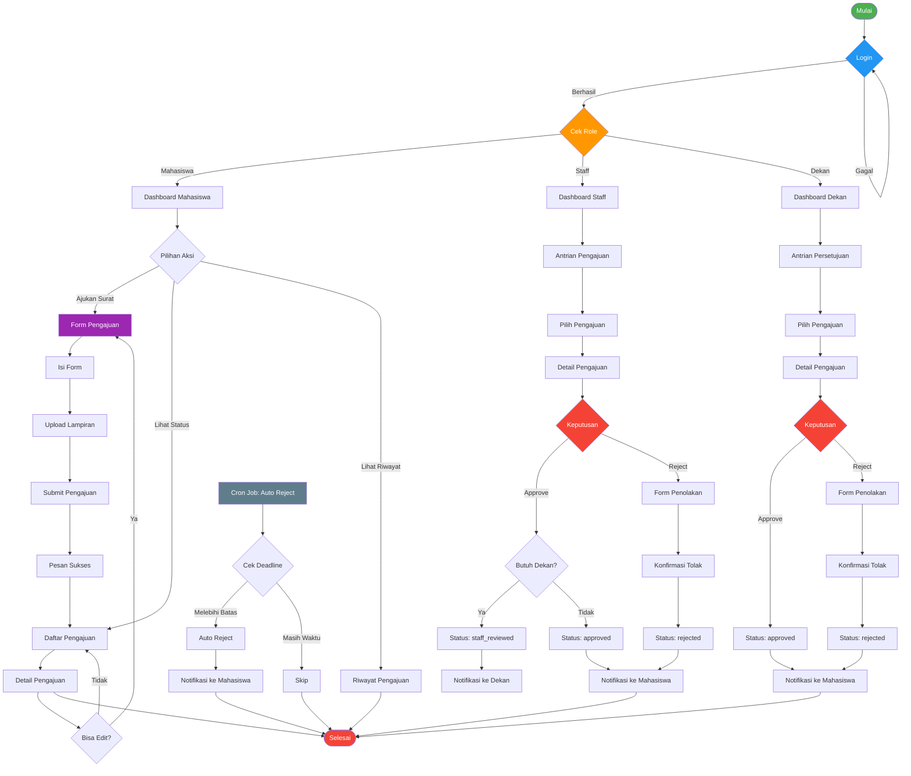

# Activity Diagram - Alur Kerja End-to-End

## Activity Diagram (Mermaid)

## Deskripsi Alur

### Alur Utama
1. **Login**: Pengguna melakukan autentikasi
2. **Role Check**: Sistem menentukan role dan mengarahkan ke dashboard
3. **Dashboard**: Menampilkan data sesuai role

### Alur Mahasiswa
1. Mengisi form pengajuan
2. Mengunggah lampiran (opsional, max 3 file)
3. Submit pengajuan
4. Melihat status dan riwayat
5. Edit pengajuan (jika masih pending)

### Alur Staff
1. Melihat antrian pengajuan
2. Review detail pengajuan
3. Approve atau Reject
4. Jika approve &requires dekan → notifikasi ke dekan
5. Jika approve &tidak requires dekan → langsung approved
6. Jika reject → masukkan alasan penolakan

### Alur Dekan
1. Melihat antrian persetujuan
2. Review detail pengajuan
3. Approve atau Reject
4. Notifikasi ke mahasiswa

### Background Jobs
1. **Cron Job**: Auto reject pengajuan melebihi deadline
2. **Queue Job**: Kirim notifikasi email async
3. **Queue Job**: Generate PDF surat
