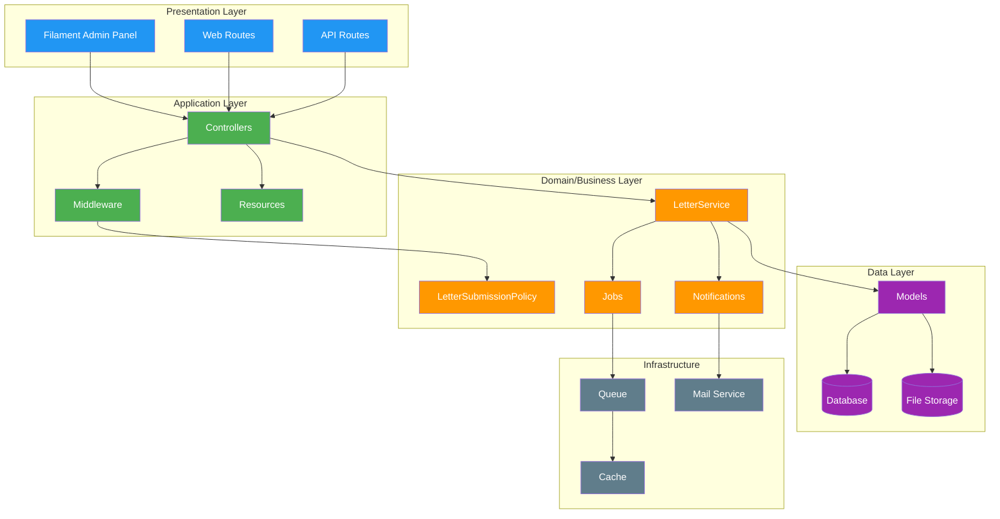
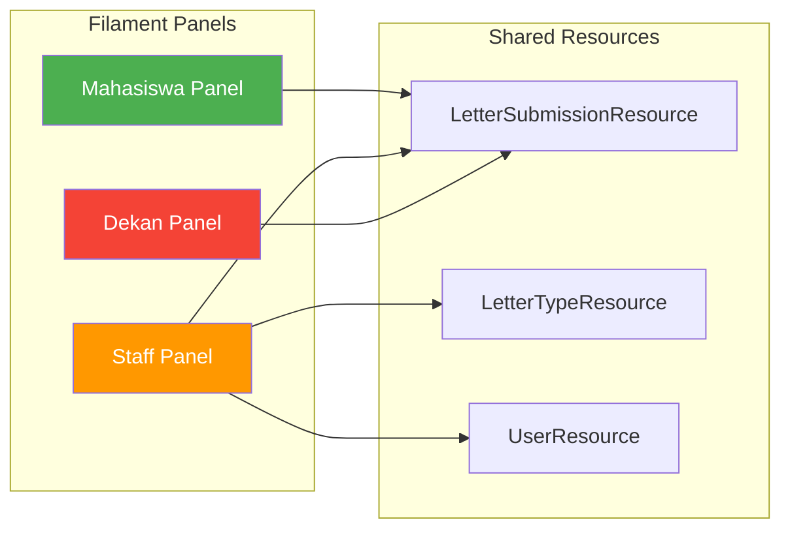
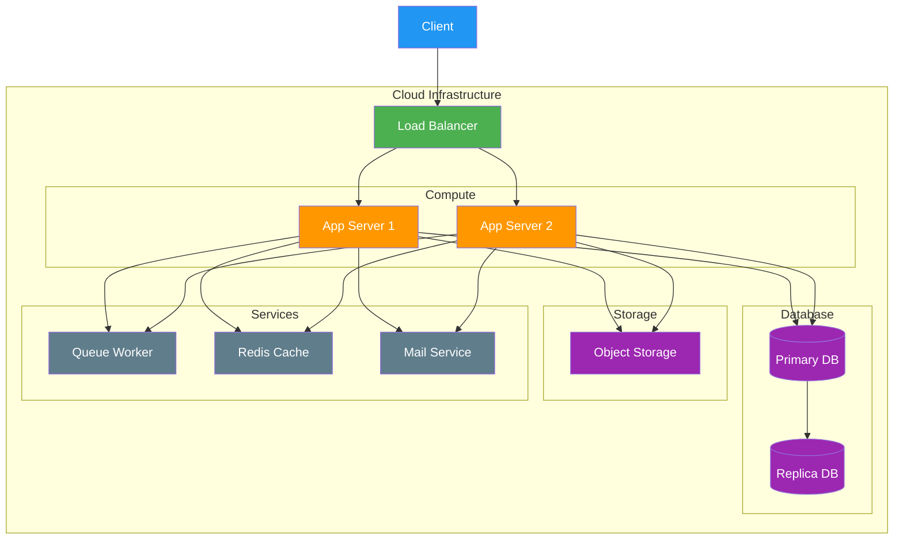

# Component Diagram - Arsitektur Aplikasi

## Component Diagram (Mermaid)

## Deskripsi Komponen

### Presentation Layer
| Komponen | Fungsi |
|----------|--------|
| Filament Admin Panel | Admin panel untuk semua role |
| Web Routes | Route web untuk akses publik |
| API Routes | API endpoint untuk integrasi |

### Application Layer
| Komponen | Fungsi |
|----------|--------|
| Controllers | Handle request dan response |
| Middleware | Autentikasi, otorisasi, rate limiting |
| Resources | Transform data untuk response |

### Domain/Business Layer
| Komponen | Fungsi |
|----------|--------|
| LetterService | Bisnis logic pengajuan surat |
| LetterSubmissionPolicy | Otorisasi akses |
| Notifications | Notifikasi email dan in-app |
| Jobs | Background processing |

### Data Layer
| Komponen | Fungsi |
|----------|--------|
| Models | Eloquent ORM models |
| Database | MySQL/PostgreSQL |
| File Storage | Storage lampiran |

### Infrastructure
| Komponen | Fungsi |
|----------|--------|
| Queue | Async job processing |
| Cache | Performance optimization |
| Mail Service | Email delivery |

## Arsitektur Filament Panels

## Deployment Architecture

