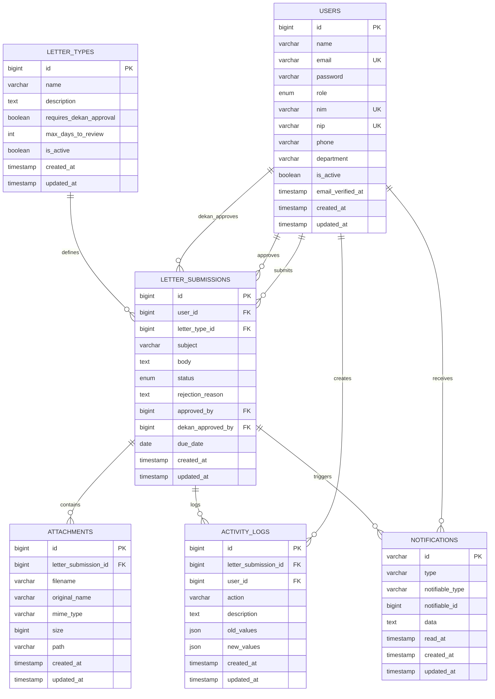
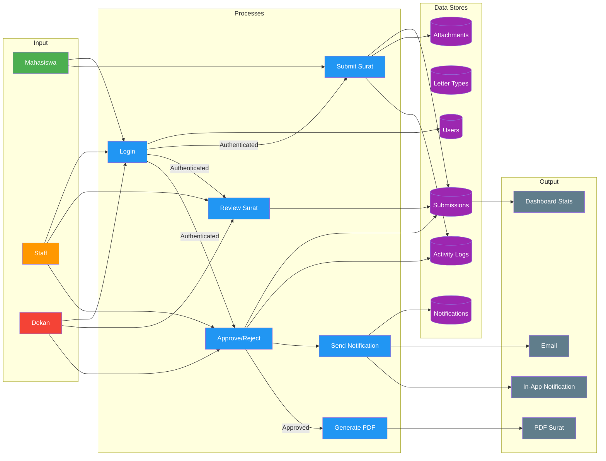

# Data Flow Diagram (ERD) - Sistem Pengajuan Surat

## Entity Relationship Diagram (Mermaid)

## Data Flow Diagram (Mermaid)

## Deskripsi Data Flow

### Input
| Input | Sumber | Proses |
|-------|--------|--------|
| Login | Semua role | Autentikasi user |
| Submit Surat | Mahasiswa | Membuat pengajuan baru |
| Review Surat | Staff/Dekan | Meninjau pengajuan |
| Approve/Reject | Staff/Dekan | Menyetujui/menolak pengajuan |

### Processes
| Proses | Input | Output | Data Store |
|--------|-------|--------|------------|
| Login | Credentials | Session | Users |
| Submit Surat | Form data + files | Submission record | Submissions, Attachments, Activity Logs |
| Review Surat | Submission ID | Detail view | Submissions |
| Approve/Reject | Decision + reason | Status update | Submissions, Activity Logs |
| Generate PDF | Submission data | PDF file | File Storage |
| Send Notification | Notification data | Email/In-App | Notifications |

### Output
| Output | Tujuan | Jenis |
|--------|--------|-------|
| Email | User/Staff/Dekan | Notifikasi status |
| In-App Notification | User/Staff/Dekan | Real-time update |
| PDF Surat | User | Dokumen resmi |
| Dashboard Stats | Semua role | Statistik |
